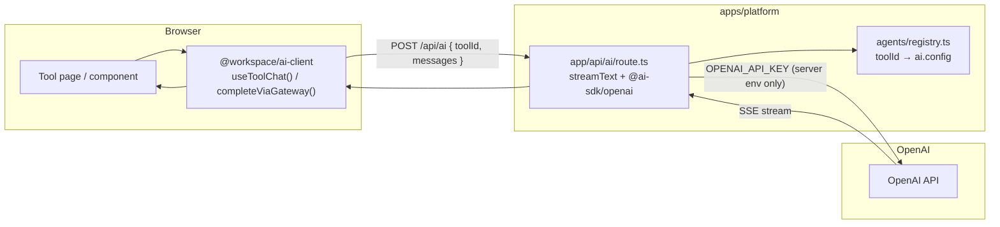

# AI-Tools

A Turborepo + pnpm monorepo of AI tools. One Next.js platform (`apps/platform`) deploys as a single Vercel project. Each tool is a route under `/tools/<name>`. Shared design language and UI live in `packages/`.

## Project structure

```
AI-Tools/
├── apps/
│   └── platform/                  ← The app (Next.js App Router)
│       ├── app/
│       │   ├── page.tsx           ← Hub — tool launcher grid
│       │   ├── api/ai/route.ts    ← Single AI gateway (only file touching the key)
│       │   └── tools/
│       │       ├── _starter/      ← Template for new tools (not routed)
│       │       └── video-curator/ ← Migrated tool
│       ├── agents/
│       │   ├── registry.ts        ← toolId → ai.config
│       │   └── types.ts
│       └── lib/
│           └── tools.config.ts    ← Hub registry (id, name, path, icon)
│
├── packages/
│   ├── config/                    ← Shared Tailwind / TS configs
│   ├── ui/                        ← Shared React components (PageLayout, etc.)
│   └── ai-client/                 ← Thin client hooks for /api/ai (no OpenAI code)
│
├── agents/                        ← Cursor agent instructions
│   └── workspace/
├── turbo.json
└── pnpm-workspace.yaml
```

| Part | Role |
|---|---|
| `apps/platform` | Single Next.js app — hub, tools, and AI gateway |
| `app/tools/<name>/` | One self-contained folder per tool |
| `packages/*` | Shared design, UI, and AI client hooks |

## AI API call flow

The OpenAI API key **never** reaches the browser. All AI calls go through one gateway route.



**Key points:**
- `packages/ai-client` is browser-safe — no SDK, no key. Tools import `useToolChat(toolId)` or `completeViaGateway({ toolId, prompt })`.
- `app/api/ai/route.ts` is the **only** file that imports `@ai-sdk/openai` or reads `OPENAI_API_KEY`.
- Each tool declares model, system prompt, and temperature in its local `ai.config.ts`. The gateway reads it from `agents/registry.ts`.
- Local dev: copy `.env.example` to `apps/platform/.env.local` and run `pnpm --filter platform dev`.

See [`agents/workspace/ai-api-flow.md`](agents/workspace/ai-api-flow.md) for the full architecture guide.

## Tech stack

Next.js 15 (App Router) + React + TypeScript · Tailwind CSS · Vercel AI SDK · Turborepo · pnpm · Vercel

## Quick start

```bash
pnpm install
cp .env.example apps/platform/.env.local   # add your OpenAI key
pnpm --filter platform dev
```

Open http://localhost:3000 — the hub lists all registered tools.

## Add a new tool

1. Copy `apps/platform/app/tools/_starter/` → `apps/platform/app/tools/<tool-name>/`
2. Edit `ai.config.ts` (toolId, model, system prompt) and build the UI in `page.tsx`
3. Add one entry to `apps/platform/lib/tools.config.ts` and one import line to `apps/platform/agents/registry.ts`
4. Done — it deploys with the platform on the next push

No Vercel project, port allocation, or per-app env linking required.
