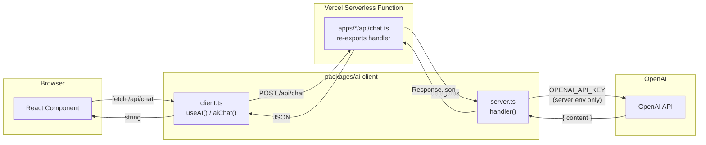

# AI-Tools

A Turborepo + pnpm monorepo of AI tools. Each tool is an independent React app; all share the same design language and UI packages. Every app deploys to Vercel separately.

## Project structure

```
AI-Tools/
├── apps/                 ← Applications
│   ├── hub/              ← Homepage launcher — links to every tool
│   ├── tool-starter/     ← Template for creating a new tool
│   └── video-curator/    ← Tool for curating video transcripts and exporting clips
│
├── packages/             ← Shared code
│   ├── config/           ← Shared Tailwind, TypeScript, and ESLint configs
│   ├── ui/               ← Shared React component library
│   └── ai-client/        ← Shared AI client (useAI hook) + server handler (OpenAI SDK)
│
├── agents/               ← Build instructions for the Cursor agent
│   └── workspace/        ← Split monorepo docs (start at workspace/README.md)
├── turbo.json
└── pnpm-workspace.yaml
```

| Part | Role |
|---|---|
| `apps/hub` | Main launcher; tool list comes from `tools.config.ts` |
| `apps/tool-*` / other tools | One independent app per tool |
| `packages/*` | Shared design, UI, and AI client used by every app |

## AI API call flow

The OpenAI API key **never** reaches the browser. All AI calls go through a shared serverless handler.



**Key points:**
- `client.ts` is browser-safe — no SDK, no key. Components import `useAI()` or `aiChat()` from `@workspace/ai-client/client`.
- `server.ts` is the **only** file that imports the OpenAI SDK or reads `OPENAI_API_KEY`. It runs as a Vercel serverless function (Node.js runtime — Edge cannot bundle monorepo workspace imports).
- Each app's `api/chat.ts` is a one-line re-export: `export { default } from "@workspace/ai-client/vercel"` (bridges Vercel `req`/`res` → Web `handler`).
- Supports `model`, `systemPrompt`, `temperature`, and `responseFormat` (JSON mode) — e.g. video-curator uses `gpt-4o-mini` with `temperature: 0` and `responseFormat: { type: 'json_object' }` for transcript segmentation.
- Local dev: `vite dev` serves `/api/chat` via a middleware in `vite.config.ts` that delegates to the same shared handler.

See [`agents/workspace/secure-ai-client.md`](agents/workspace/secure-ai-client.md) for the full architecture guide and rules.

## Tech stack

React + Vite + TypeScript · Tailwind CSS · Turborepo · pnpm · Vercel

## Quick start

```bash
pnpm install
pnpm dev
```

## Add a new tool

1. Copy `apps/tool-starter/` → `apps/tool-myname/`
2. In the copy, set `"name": "tool-myname"` in `package.json`
3. Pick a free Vite port in `vite.config.ts` (hub `5173`, video-curator `5174`, tool-starter `5175`, next free…)
4. Build the tool in `src/App.tsx` (keep `PageLayout`)
5. Register it in `apps/hub/src/tools.config.ts` with `devUrl` (`http://localhost:<port>`) and a placeholder `url`
6. Deploy on Vercel (one project per app):
   - **Root Directory:** `apps/tool-myname`
   - **Build Command / Install / Output:** already set in the copied `vercel.json` (update the `--filter` name)
   - Enable **Include source files outside of the Root Directory** (for `packages/*`)
7. Link the team shared `OPENAI_API_KEY` to the new Vercel project (do not create a duplicate project-level key):
   - Team Settings → **Environment Variables** (team / Shared — not the project Project tab)
   - Open shared `OPENAI_API_KEY` → **Edit** → **Link to Projects** → add the new project
   - Environments: Production (and Preview if needed)
   - Redeploy the new project after linking
   - Note: a project-level `OPENAI_API_KEY` overrides the shared one (“Overridden by Project”); remove the project copy if you intend to use Shared
8. Set the live `url` in `tools.config.ts`. Hub back-links use `HUB_PROD_URL` in `packages/ui/src/hub.ts` (localhost in DEV).
