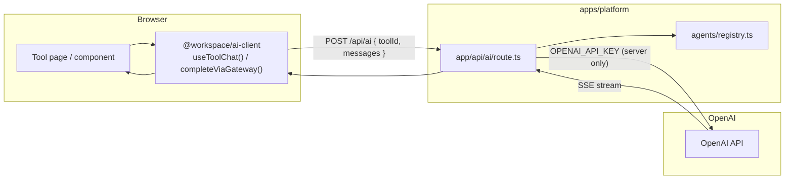

# AI API Flow — Architecture & Roadmap

How AI calls travel from a React component through the platform gateway to OpenAI and back, why the OpenAI API key never reaches the browser, and what still needs to be done for production hardening.

> Related: [06-packages-ai-client.md](./06-packages-ai-client.md) (`@workspace/ai-client` hooks) and [`../Migration.md`](../Migration.md) (full platform migration spec).

---

## 1. Goal

The OpenAI API key must **never** appear in the browser bundle. Every tool POSTs to `/api/ai` with a `toolId`. The gateway looks up that tool's `ai.config.ts` (model, system prompt, temperature) and streams the response. Tool code never imports the OpenAI SDK or touches a key.

---

## 2. Request flow

**Step by step:**

1. A chat UI calls `useToolChat(toolId)` from `@workspace/ai-client`, which wraps the AI SDK's `useChat` pointed at `/api/ai` with `toolId` in the body.
2. A one-shot caller (e.g. transcript segmentation) uses `completeViaGateway({ toolId, prompt })`, which POSTs a single user message and consumes the SSE stream to completion.
3. `app/api/ai/route.ts` validates `toolId`, loads config from `agents/registry.ts`, and runs `streamText` with `@ai-sdk/openai`.
4. The route returns `toUIMessageStreamResponse()` so client hooks stream out of the box.

---

## 3. Key files

| File | Role | Runs where |
| --- | --- | --- |
| `packages/ai-client/src/useToolChat.ts` | Streaming chat hook. No SDK, no key. | Browser |
| `packages/ai-client/src/completeViaGateway.ts` | One-shot completion helper. No SDK, no key. | Browser |
| `apps/platform/app/api/ai/route.ts` | **Only** file that imports `@ai-sdk/openai` and reads `OPENAI_API_KEY`. | Server |
| `apps/platform/agents/registry.ts` | Maps `toolId` → each tool's `ai.config.ts`. | Server (imported by gateway) |
| `apps/platform/app/tools/<name>/ai.config.ts` | Per-tool model, temperature, system prompt. | Config (imported by registry) |

---

## 4. Rules for agents

- **Never** import `openai` or `@ai-sdk/openai` from tool code, server actions, or `packages/ai-client`.
- **Never** prefix the API key with `NEXT_PUBLIC_` or `VITE_`.
- All new tools use `useToolChat(toolId)` or `completeViaGateway({ toolId, prompt })` from `@workspace/ai-client`.
- When adding a tool, register its `ai.config.ts` in `agents/registry.ts` (one import line).

---

## 5. Roadmap — production hardening

Placeholder comments in `app/api/ai/route.ts` mark where these go:

| Concern | Status |
| --- | --- |
| API key hidden from browser | Done |
| Single shared gateway | Done |
| Per-tool model / prompt config | Done |
| Streaming responses | Done |
| Authentication (Supabase) | **TODO** |
| Per-user usage logging | **TODO** |
| Rate limiting | **TODO** |
| Cost guardrails | **TODO** |
| Input size limits | **TODO** |
