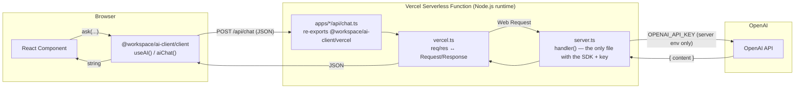

# AI API Flow — Architecture & Roadmap

How AI calls travel from a React component to OpenAI and back, why the OpenAI
API key never reaches the browser, and what still needs to be done to make the
flow production-grade.

> Related docs: [secure-ai-client.md](./secure-ai-client.md) (implementation guide + the
> five hard constraints) and [06-packages-ai-client.md](./06-packages-ai-client.md)
> (`@workspace/ai-client` package internals).

---

## 1. Goal

The OpenAI API key must **never** appear in the browser bundle. Every tool app exposes a
single serverless route (`/api/chat`). React components call that route through a shared
fetch wrapper — they never import the OpenAI SDK or touch a key. All OpenAI logic lives in
one shared file so there is exactly one place to audit and harden.

---

## 2. Request flow

**Step by step:**

1. A component calls `ask({ messages, systemPrompt?, model?, temperature?, responseFormat? })`
   from the `useAI()` hook (or the lower-level `aiChat()`), imported from
   `@workspace/ai-client/client`.
2. That wrapper does a `fetch("/api/chat", { method: "POST", ... })` — a relative URL, no key.
3. Vercel routes `/api/chat` to `apps/<app>/api/chat.ts`, which re-exports the default handler
   from `@workspace/ai-client/vercel`.
4. `vercel.ts` adapts Vercel's Node `(req, res)` into a Web `Request`, calls the shared
   `handler()` in `server.ts`, and writes the `Response` back to `res`.
5. `server.ts` reads `OPENAI_API_KEY` from server env, calls the OpenAI SDK, and returns
   `{ content }` (or a structured error).
6. The wrapper resolves to a plain string for the component.

---

## 3. Key files

| File | Role | Runs where |
| --- | --- | --- |
| `packages/ai-client/src/client.ts` | `useAI()` hook + `aiChat()` fetch wrapper. No SDK, no key. | Browser |
| `packages/ai-client/src/server.ts` | `handler(request: Request)` — the **only** file that imports the OpenAI SDK and reads `OPENAI_API_KEY`. | Server |
| `packages/ai-client/src/vercel.ts` | Adapts Vercel Node `(req, res)` ↔ Web `Request`/`Response`; default export used as the function entry. | Server |
| `apps/*/api/chat.ts` | One-line re-export: `export { default } from "@workspace/ai-client/vercel"`. | Server |
| `packages/ai-client/tsconfig.build.json` | Compiles `src/*` → `dist/*.js` so the Node runtime can import compiled JS (not raw `.ts`). | Build |

---

## 4. Why it is secure today

- **The key never reaches the browser.** It is read only server-side (`server.ts` via
  `globalThis.process`), and is never prefixed with `VITE_`, so bundlers cannot inline it.
- **Single choke point.** All AI traffic flows through one shared `handler()` — one place to
  audit, patch, or add controls.
- **Clean separation of concerns.** Browser code imports only `.../client`; the SDK and key
  live exclusively in the serverless function.
- **Structured errors.** Failures return JSON (`{ error, details? }`) with sensible status
  codes instead of leaking stack traces; the missing-key case is handled gracefully.

---

## 5. Roadmap — what to do before public production

The flow is production-ready for an **internal tool or a demo behind a login**. For a
**public deployment**, address the items below (roughly in priority order). All of them are
implemented in the one shared `server.ts`, so they apply to every app at once.

### 5.1 Authentication (highest priority)
- **Problem:** `/api/chat` is currently open. Anyone who finds the deployed URL can POST to it
  and spend your OpenAI credits — it is effectively an open proxy.
- **Do:** require a caller identity — e.g. a shared-secret header check in `server.ts`, or (better)
  validate a real user session/JWT from your auth provider before calling OpenAI.

### 5.2 Rate limiting / abuse protection
- **Problem:** a single client or bot can hammer the endpoint.
- **Do:** add per-IP / per-user rate limiting (e.g. Vercel KV / Upstash Redis token bucket).
  Pairs naturally with auth (limit per authenticated user).

### 5.3 Cost guardrails
- **Problem:** no `max_tokens` cap and no per-user/day budget, so a buggy or malicious caller
  can run up a large bill.
- **Do:** set a `max_tokens` ceiling, restrict which `model` values are allowed, and track
  spend per user/day with a hard cutoff.

### 5.4 Input validation limits
- **Problem:** `messages` size/length is unbounded.
- **Do:** cap the number of messages and total payload size; reject oversized requests with 413.

### 5.5 Observability
- **Problem:** no logging/metrics on usage, latency, or errors.
- **Do:** log request metadata (user, model, tokens, latency, status) to a metrics/logging sink
  to detect abuse and debug production issues. Avoid logging prompt contents unless needed and
  compliant.

### 5.6 Nice-to-haves
- **Streaming responses** — replace `Response.json({ content })` with a `ReadableStream` and
  update `client.ts` to consume it, for faster perceived latency.
- **Per-tool system prompts / model policy** — centralize allowed models and default prompts.
- **Retries & timeouts** — bounded retry on transient 429/5xx from OpenAI with a request timeout.

---

## 6. Status checklist

| Concern | Status |
| --- | --- |
| API key hidden from browser | Done |
| Single shared handler | Done |
| Structured error handling | Done |
| Authentication on `/api/chat` | **TODO** |
| Rate limiting | **TODO** |
| Cost guardrails (`max_tokens`, model allowlist, budgets) | **TODO** |
| Input size/validation limits | **TODO** |
| Observability (logging/metrics) | **TODO** |
| Streaming | Optional / future |
